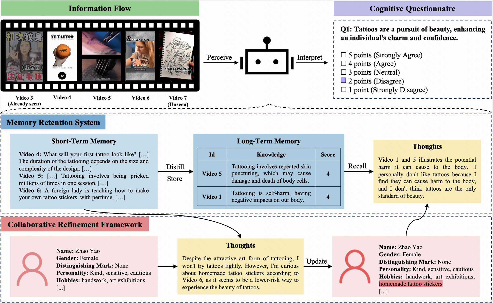

<p align="left">
    English | <a href="README_ZH.md">中文</a>
</p>
<br><br>

Code and data for the paper "<a href="https://arxiv.org/abs/2401.08438">CogGPT: Unleashing the Power of Cognitive Dynamics on Large Language Models</a>".

## CogBench

**<a href="https://huggingface.co/datasets/kwaikeg/CogBench">CogBench</a>** is a bilingual benchmark specifically designed to evaluate the cognitive dynamics of Large Language Models (LLMs) in both Chinese and English. CogBench is divided into two parts based on the type of information flow: CogBench<sub>a</sub> for articles and CogBench<sub>v</sub> for short videos.

In this benchmark, both an LLM and a human are assigned the same initial profile and receive identical information flows over 10 iterations. After each iteration, they are required to complete the same cognitive questionnaire. This questionnaire, using a five-point Likert scale, allows participants to express their attitudes towards the current questions.

CogBench aims to assess the cognitive alignment between the LLM and the human. The evaluation metrics include:

1. **Authenticity**: Measures the consistency of ratings between the LLM and the human.
2. **Rationality**: Assesses the reasoning provided by the LLM.

## CogGPT

**CogGPT** is an LLM-driven agent, designed to showcase the cognitive dynamics of LLMs. Confronted with ever-changing information flows, CogGPT regularly updates its profile and methodically stores preferred knowledge in its long-term memory. This unique capability enables CogGPT to sustain role-specific cognitive dynamics, facilitating lifelong learning.

<br>

<p align="center">
   
</p>

## News

* 2024.01.17 - [Paper](https://arxiv.org/abs/2401.08438) released.
* 2024.01.12 - [CogBench](https://huggingface.co/datasets/kwaikeg/CogBench) released.
* 2024.01.05 - Project initially released.

## User Guide

### Setup

Follow these steps to build CogBench:

1. **Clone the Repository**: Clone this repository to your local environment.
2. **Switch Directory**: Use the `cd` command to enter the repository directory.
3. **Download Data**: Download the [CogBench](https://huggingface.co/datasets/kwaikeg/CogBench) and save it in the `dataset` directory.
4. **Run Experiments**: Implement your method using `cogbench_a.json` and `cogbench_v.json` for CogBench<sub>a</sub> and CogBench<sub>v</sub>, respectively, and record your experimental results.
5. **Evaluate Results**: Fill in the `eval_cogbench_a.json` and `eval_cogbench_v.json` files with your experimental results for evaluations.

### Evaluation

To evaluate your method based on the authenticity and rationality metrics, we recommend running the following commands:

```bash
python evaluation.py --file_path <YOUR_FILE_PATH> --method <YOUR_METHOD_NAME> --authenticity --rationality
```

For example, to evaluate the `CoT` method on CogBench<sub>v</sub>, run:

```bash
python evaluation.py --file_path dataset/english/eval_cogbench_v.json --method CoT --authenticity --rationality
```

The evaluation scores will be displayed as follows:

```bash
======= CoT Authenticity =======
Average authenticity: 0.15277666156947955
5th iteration authenticity: 0.3023255813953488
10th iteration authenticity: 0.13135593220338992
======= CoT Rationality =======
Average rationality: 3.058333333333333
5th iteration rationality: 3.7666666666666666
10th iteration rationality: 3.0833333333333335
```

Please refer to <a href="https://huggingface.co/datasets/kwaikeg/CogBench">CogBench</a> for more details.