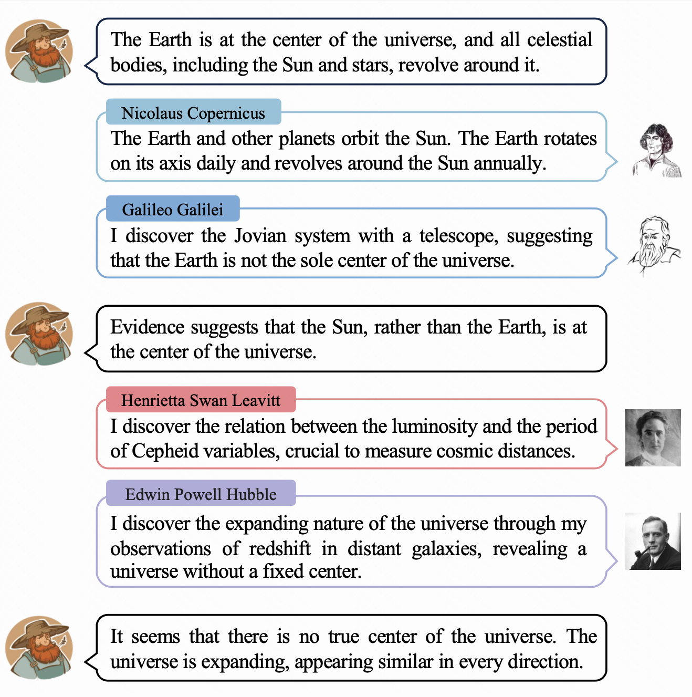

<p align="left">
    <a href="README.md">English</a> ｜ 中文
</p>
<br><br>

<p align="center">
      📚 CogBench (upcoming) | 📑 Paper (upcoming)
<br>

CogGPT 是[快手快知团队](https://github.com/KwaiKEG)开源的一整套Agent系列工作。开源的内容包括

1. **CogBench**: 一个专门用于评估LLMs的认知动态的基准测试。
2. **CogGPT**: 一个具有迭代认知机制的LLM-driven agent。 
<br>

## 什么是认知动态

下图为人类认知动态的一个示例。一个人（左侧）的宇宙观随着动态信息流（右侧）的影响而发生持续性的转变。
<p align="center">
    
<p>

<br>

## CogGPT

<p align="center">
    
<p>

## 动态
* 2024.01.05 - 项目公开

## 使用指南

### 评价
```bash
git clone git@github.com:KwaiKEG/CogGPT.git
cd CogGPT
python evaluation.py --file_path datasets/english/eval_cogbench_v.json --authenticity --rationality
```
